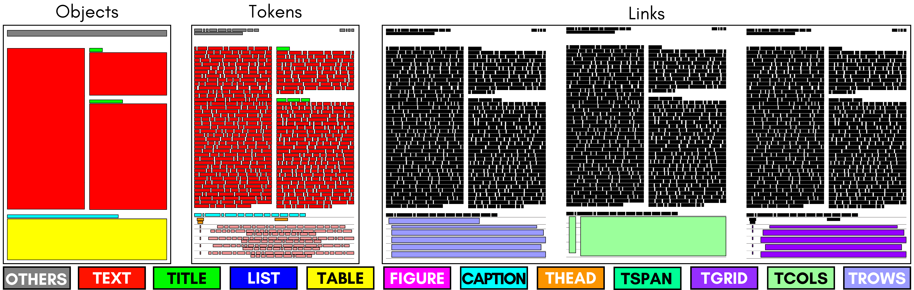

# Contextualized Table Extraction Dataset
- [Contextualized Table Extraction Dataset](#contextualized-table-extraction-dataset)
  - [The CTE Dataset](#the-cte-dataset)
  - [Generate CTE annotations](#generate-cte-annotations)
  - [Project Tree](#project-tree)
  - [Config File Format](#config-file-format)
  - [Cite this project](#cite-this-project)

## The CTE Dataset


We have build new annotations for the defined Contextualized Table Extraction task, fusing two well known datasets:
- [PubLayNet](https://developer.ibm.com/exchanges/data/all/publaynet/)[^1], a dataset for Document Layout Analysis with 5 different labeld regions;
- [PubTables-1M](https://msropendata.com/datasets/505fcbe3-1383-42b1-913a-f651b8b712d3)[^2], a dataset to perform Table Detection, Table Structure Recognition and Functional Analysis.

Tables are really important sources of information for research purposes, and giving them a context (instead of just focusing on them) can help in their extraction. We have been inspired by mainly two works:
- [DocBank](https://doc-analysis.github.io/docbank-page/index.html)[^3], to reformulate the problem as a token-classification task
- AxCell[^4], to give table a context also for comparable resarch porpuses

You can read more details in our paper: `CTE: Contextualized Table Extraction Dataset` (under review)

**About the PDF data:**
We do not own the copyright of the original data and we cannot redistribute them.
The PDF files can be downloaded from [here](https://github.com/ibm-aur-nlp/PubLayNet).

[^1]: Xu Zhong et al., PubLayNet: largest dataset ever for document layout analysis, ICDAR 2019.
[^2]: B. Smock et al., "Towards a universal dataset and metrics for training and evaluating table extraction models", arXiv, November 2021.
[^3]: Li, Minghao, et al. "DocBank: A benchmark dataset for document layout analysis." arXiv preprint arXiv:2006.01038 (2020).
[^4]: Kardas, Marcin, et al. "Axcell: Automatic extraction of results from machine learning papers." arXiv preprint arXiv:2004.14356 (2020)

---

## Generate CTE annotations
Run in your environment:
```
pip install -e .
```
to install dependencies.

After that, download:
1. PubLayNet annotations from [here](https://github.com/ibm-aur-nlp/PubLayNet) 
2. PubTables-1M-PDF_Annotations_JSON from [here](https://github.com/microsoft/table-transformer)
And collocate them as described in Project Tree section.

Finally, to generate the annotations, run:
```
python src/generate_annotations.py
```
You will find train, val and test annotation json files in the data/merged subfolder.

<!--(Then, download annotations and baselines from `here`.) -->

## Project Tree
```
  ├── setup.py - Initialization script
  ├── visualization.ipynb - Visualize annotations on example images
  │
  ├── src/
  │   ├── generate_annotations.py - Annotation json files generation 
  │   └── data/ - folder of scripts used by generate_annotations.py
  │
  ├── data/ - where papers and annotations are stored
  │   ├── publaynet/ - train, val, test jsons and PubLayNet_PDF folder
  │   ├── pubtables-1m/ - PubTables-1M-PDF_Annotations_JSON folder
  │   └── merged/
  │       ├── test.json - CTE annotations (as described in config file format section)
  │       ├── train.json - CTE annotations (as described in config file format section)
  │       └── val.json - (CTE annotations as described in config file format section)
  ```

## Config File Format
Config files are in `.json` format. Example:
```
  "objects": 
      {
        "PMC#######_000##.pdf": 
          [
            [0, [157, 241, 807, 738], 1],
            [1, [157, 741, 807, 1238], 1],
            ...
          ]
        ...
      },
  "tokens":
      {
        "PMC#######_000##.pdf":
          [
            [0, [179, 241, 344, 271], 'Unfortunately,', 1, 0],
            [1, [354, 241, 412, 271], 'these', 1, 0],
            [2, [423, 241, 604, 271], 'quality-adjusted', 1, 0],
            ...
          ]
        ...
      }
  "links":
      {
        "PMC#######_000##.pdf":
          [
            ...,
            [9, 11, [31, 41]],
            [10, 12, [22, 23, 24, 25, 26, 27, 28, 29, 30, 31]],
            ...
          ]
        ...
      }
```
Each object has these information:
- object id
- bounding box coordinates
- class id

Each token has these information:
- token id
- bounding box coordinates
- text
- class id
- object id (to which it belongs)
  
Each link has these information:
- link id
- class id
- token ids (list of tokens linked together)

## Cite this project
If you want to use our dataset in your project[^1], please cite us:
```
@misc{https://doi.org/10.48550/arxiv.2302.01451,
  doi = {10.48550/ARXIV.2302.01451},
  url = {https://arxiv.org/abs/2302.01451},
  author = {Gemelli, Andrea and Vivoli, Emanuele and Marinai, Simone},
  keywords = {Computation and Language (cs.CL), Computer Vision and Pattern Recognition (cs.CV), FOS: Computer and information sciences, FOS: Computer and information sciences},
  title = {CTE: A Dataset for Contextualized Table Extraction},
  publisher = {arXiv},
  year = {2023},
  copyright = {Creative Commons Attribution Share Alike 4.0 International}
}

```
