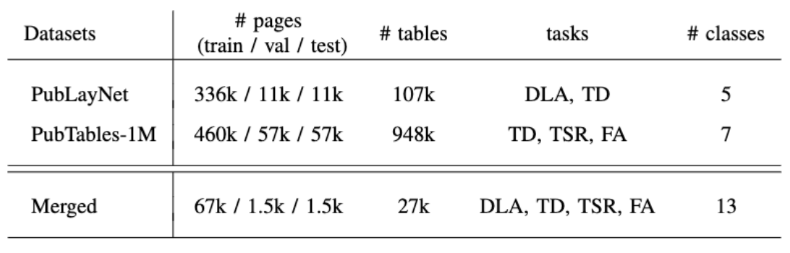
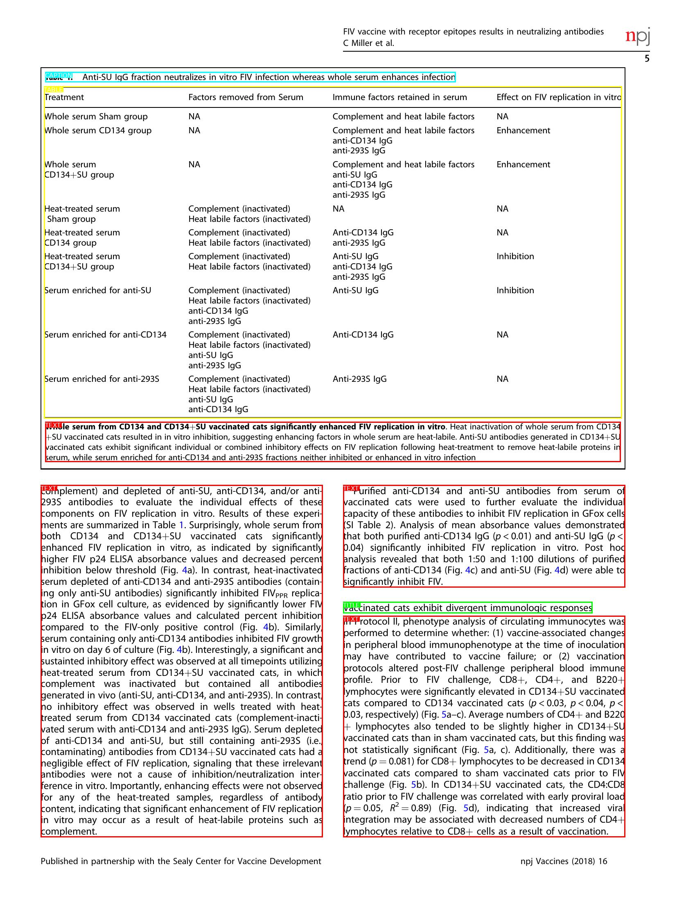
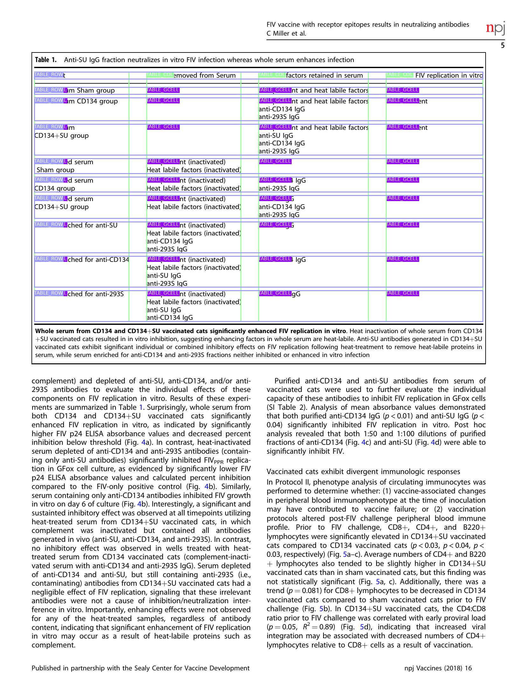
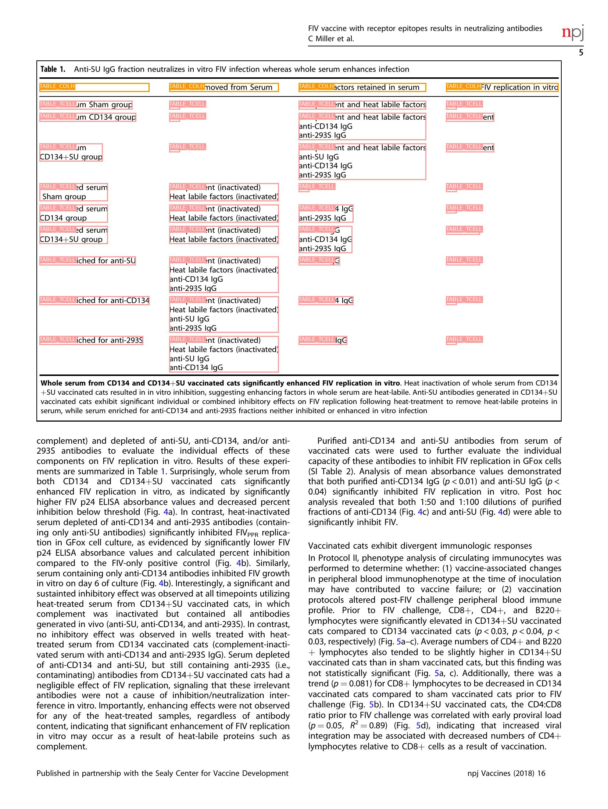

# Contextualized Table Extraction Dataset
- [Contextualized Table Extraction Dataset](#contextualized-table-extraction-dataset)
    - [Dataset Numbers](#dataset-numbers)
    - [A couple of examples](#a-couple-of-examples)
  - [Init](#init)
  - [PDF data](#pdf-data)
  - [Project Tree](#project-tree)
  - [Config File Format](#config-file-format)
  - [Cite this project](#cite-this-project)

We have build a dataset for Contextualized Table Extraction fusing two well known datasets:
- [PubLayNet](https://developer.ibm.com/exchanges/data/all/publaynet/)[^1], a dataset for Document Layout Analysis with 5 different labeld regions
- [PubTables-1M](https://msropendata.com/datasets/505fcbe3-1383-42b1-913a-f651b8b712d3)[^2], a dataset to perform Table Detection, Table Structure Recognition and Functional Analysis.

Tables are really important sources of information for research purposes, and giving them a context (instead of just focusing on them) can help in their extraction. We have been inspired by mainly two works:
- [DocBank](https://doc-analysis.github.io/docbank-page/index.html)[^3], to reformulate the problem as a token-classification task
- AxCell[^4], to give table a context also for comparable resarch porpuses

You can read more details in our paper: `Contextualized Table Extraction Dataset`

---

### Dataset Numbers


---

### A couple of examples
<p>
  
   
  
</p>

[^1]: Xu Zhong et al., PubLayNet: largest dataset ever for document layout analysis, ICDAR 2019.
[^2]: B. Smock et al., "Towards a universal dataset and metrics for training and evaluating table extraction models", arXiv, November 2021.
[^3]: Li, Minghao, et al. "DocBank: A benchmark dataset for document layout analysis." arXiv preprint arXiv:2006.01038 (2020).
[^4]: Kardas, Marcin, et al. "Axcell: Automatic extraction of results from machine learning papers." arXiv preprint arXiv:2004.14356 (2020)

---

## Init
Run in your environment:
```
pip install -e .
```
to install dependencies.

After that, download:
1. PubLayNet annotations from [here](https://github.com/ibm-aur-nlp/PubLayNet) 
2. PubTables-1M-PDF_Annotations_JSON from [here](https://github.com/microsoft/table-transformer)
And collocate them as described in Project Tree section.

<!--(Then, download annotations and baselines from `here`.) -->

## PDF data
We do not own the copyright of the original data and we cannot redistribute them.
If you need the data, download them directly from their sites.

## Project Tree
```
  ├── setup.py - Initialization script
  ├── visualization.ipynb - Visualize annotations on example images
  │
  ├── src/
  │   ├── generate_annotations.py - Annotation json files generation 
  │   └── data/ - folder of scripts used by generate_annotations.py
  │
  ├── data/ - where papers and annotations are stored
  │   ├── publaynet/ - train, val, test jsons and PubLayNet_PDF folder
  │   ├── pubtables-1m/ - PubTables-1M-PDF_Annotations_JSON folder
  │   └── merged/
  │       ├── region_annotations.json - bigger regions of the page in terms of bounding boxes
  │       └── token_annotations.json - token bounding boxes, textual content and links.
  │
  ├── baselines/ - weights of baseline models
  ├── imgs / - examples
  ```

## Config File Format
Config files are in `.json` format. Example:
```
  "objects": 
      {
        "PMC3226315_00001.pdf": 
          [
            [0, [140, 718, 808, 779], 1],
            ...
          ]
        ...
      }
  "tokens":
      {
        "PMC3226315_00001.pdf":
          [
            [],
            ...
          ]
        ...
      }
```
Each object has these information:
- object id
- bounding box coordinates
- class id

Each token has these information:
- token id
- bounding box coordinates
- text
- class id
- object id (to which it belongs)
  
Each link has these information:
- link id
- class id
- token is (list of tokens linked together)

## Cite this project
If you want to use our dataset in your project[^1], please cite us:
```
@inproceedings{neumann-etal-2019-scispacy,
    title = "CTE: Contextualized Table Extraction Dataset",
    author = "Gemelli, Andrea  and Vivoli, Emanuele",
    abstract = "Lorem Ipsum is simply dummy text of the printing and typesetting industry. Lorem Ipsum has been the industry's standard dummy text ever since the 1500s, when an unknown printer took a galley of type and scrambled it to make a type specimen book. It has survived not only five centuries, but also the leap into electronic typesetting, remaining essentially unchanged. It was popularised in the 1960s with the release of Letraset sheets containing Lorem Ipsum passages, and more recently with desktop publishing software like Aldus PageMaker including versions of Lorem Ipsum",
}
```
